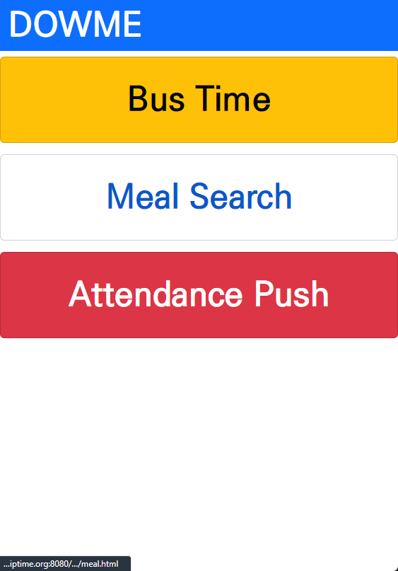
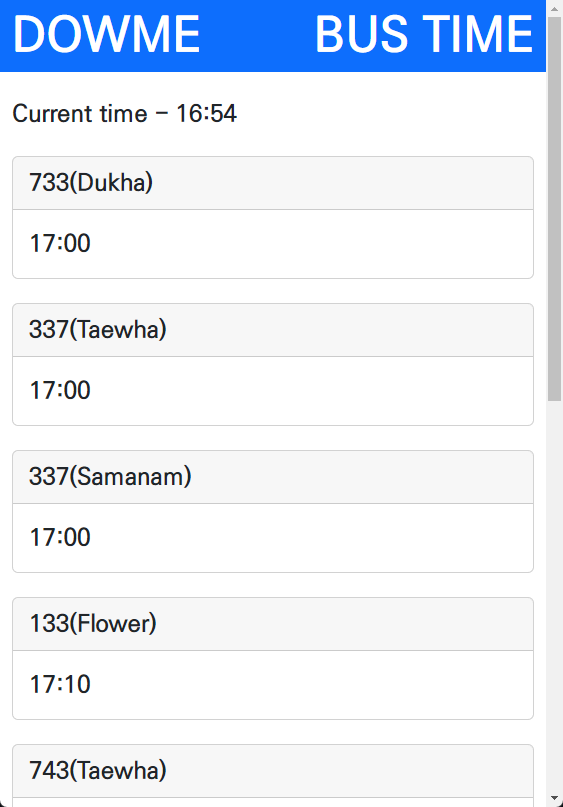
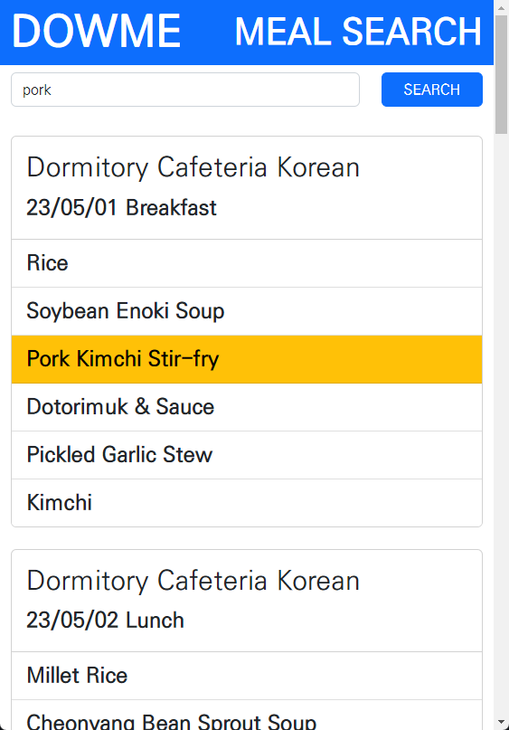
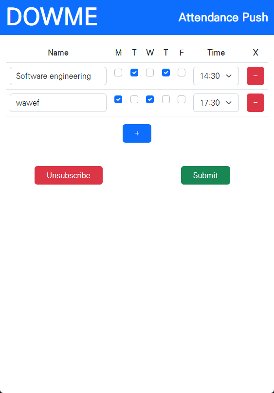

# DOWME
UNIST 2023S1 CSE36401 Software Engineering Group 10

20171260 JunGu Han 한준구
20181014 YoungJin Kwon 권영진

***

Milestone 3 Done

***



### Just tap the button what you want!

DOWME is helper web application for the UNIST members. 
It provides information about the bus departing soon, searching meal menus, notification for attendance check.

***

## Bus Time



When open this page, you can see the bus timetable with sorted by order of departing time.

## Meal Search



You can search specific meal menu with this page. Just type the menu name and tap the search button

## Attendance Check Notification



Submit your own lecture timetable! Recent web-push technology gives you a push notification.
When you submit the timetable, browser requests the permission of notification service. PLEASE ALLOW IT!

You can receive push notification 10 minutes before class start.

Server will automatically send push notification about 10 minutes for valid member.
If you don't connect with 'localhost' or '127.x.y.z' push service can't send notification because of security issue.
If you run the server with SSL setup, it will fine.

***

## Specify

Web standard limit the function on http, notification service will only be activated on https.

If you want to test push notification, try this link.

```
http://{url for app}/sendpush?time=31350

param:
    time: 5-digits number. dayCode + hour + minute
        dayCode: 1-5 to Mon-Fri
        hour: 0-23
        minute: 0-59
        (31350 means wednesday, 13:50)
        
Expected behaviour:
    It send a push notification like the time is the entered one.
    So you can test with 31350 if you submit wednesday, 14:00 lecture.
```